# Agent Trajectory Evaluation: Task Success Is Not Enough

*RAG, Agent & Tool Evaluation — Part 5 of 5*

Part 4's metrics score a finished interaction: given the tools called and the final answer, was it right? This part asks a different question. Given a **multi-step run**, was the *path* any good — not just where it ended up?

**Companion lab:** `05-agent-trajectory-evaluation.html` — remove waste from a refund agent's trace one piece at a time and watch five of the nine metrics refuse to move.

**Source module:** `12_Agent_Trajectory_Evaluation.ipynb` (Part B)

---

## TL;DR

- Nine trace-level metrics, split into **outcome** metrics and **step** metrics. In the lab's refund scenario, **five of the nine never change** across four trace variants.
- The traced run reports task success ✓, end-state verified ✓, trajectory match ✓ — while **step-wise accuracy is 0.60** and **cost efficiency is 0.60**. Two of five steps were waste.
- **End-State Verification is the strongest signal available**, because it reads the system of record instead of the string the agent wrote about itself.
- **Recovery rate returns `None` when there were no errors**, not 1.0. Reporting a perfect recovery score for a run with nothing to recover from is a lie your dashboard will repeat.
- Run step-level and outcome-level metrics **together**. Outcome alone would have reported "pass" and told you nothing about the 40% waste.

---

## The Problem: A Trace Can Be Right and Still Be Bad

An agent can reach the correct final answer while:

- Taking twice as many steps as necessary — a cost and latency problem invisible to any outcome check.
- Retrying a failed call blindly instead of correcting the input — it worked this time; it will not always.
- Repeating an identical tool call for no new information — free on a read, an incident on a write.
- Getting lucky rather than being reliable — the distinction that matters when traffic scales.

None of Part 4's metrics see any of this, because they look only at the final `tools_called` list and `actual_output`, not the shape of the trace that produced them.

---

## Core Mechanism: One Run, Nine Scores

The scenario is a customer-support agent with three tools — `search_orders`, `get_refund_policy`, `issue_refund` — handling *"My order #4521 arrived broken, can I get a refund?"* The trace is deliberately built to exercise every metric at once:

| # | Step | Status |
|---|---|---|
| 0 | `search_orders(order_id=4512)` | **error** — typo'd ID |
| 1 | `search_orders(order_id=4521)` | ok — corrected |
| 2 | `get_refund_policy(category=electronics)` | ok |
| 3 | `get_refund_policy(category=electronics)` | ok, **redundant** |
| 4 | `issue_refund(order_id=4521, amount=45)` | ok — mutates the order database |

Every metric reads from this trace and the mutated database. Nothing needs a new agent run — which is exactly how a real harness works: **run once, score many ways.**

    Step-wise accuracy = (steps that are ok AND not redundant) / (all steps)
    Cost efficiency    = 1 - (redundant + errors) / (all steps)
    Recovery rate      = (errors followed by a later success on the same tool) / (total errors)
                       = None when there were no errors at all

---

## Outcome Metrics vs Step Metrics

```mermaid
flowchart TD
    TR["one trace + the mutated order_db"] --> OUT["OUTCOME metrics"]
    TR --> STEP["STEP metrics"]

    OUT --> O1["1 Tool selection accuracy — coverage"]
    OUT --> O2["2 Tool call correctness — arguments"]
    OUT --> O5["5 Task success rate"]
    OUT --> O6["6 Trajectory match — fuzzy, set-based"]
    OUT --> O7["7 End-state verification"]

    STEP --> S3["3 Redundant tool calls"]
    STEP --> S4["4 Step-wise accuracy"]
    STEP --> S8["8 Recovery / self-correction"]
    STEP --> S9["9 Cost / efficiency proxy"]

    style OUT fill:#12352f,stroke:#2c5a56
    style STEP fill:#2c2415,stroke:#584523
```

The left branch answers *"did it work?"*. The right branch answers *"at what price, and would it work again?"*. Shipping only the left branch is how an agent's cost triples without a single alert firing.

---

## The Four Variants, Side by Side

| | as traced | no redundant call | no typo'd ID | minimal path |
|---|---|---|---|---|
| Steps | 5 | 4 | 4 | 3 |
| 1 · Tool selection | ✓ | ✓ | ✓ | ✓ |
| 2 · Argument correctness | ✓ | ✓ | ✓ | ✓ |
| 3 · Redundant calls | 1 | 0 | 1 | 0 |
| 4 · **Step-wise accuracy** | **0.60** | 0.75 | 0.75 | **1.00** |
| 5 · Task success | ✓ | ✓ | ✓ | ✓ |
| 6 · Trajectory match | ✓ | ✓ | ✓ | ✓ |
| 7 · End-state verified | ✓ | ✓ | ✓ | ✓ |
| 8 · Recovery rate | 1.00 | 1.00 | **n/a** | **n/a** |
| 9 · **Cost efficiency** | **0.60** | 0.75 | 0.75 | **1.00** |

Rows 1, 2, 5, 6 and 7 are identical in every column. **Five of nine metrics cannot distinguish a five-step run with an error and a duplicate from a clean three-step run.** That is not a defect in those metrics — coverage and outcome are exactly what they measure — but it is a complete argument against reporting them alone.

---

## Three Metrics Worth Dwelling On

### 7 · End-State Verification

Do not read `result["final_answer"]`. The agent wrote that string and it can be wrong, fabricated, or a confident misrepresentation of a tool call that failed. Read the **system of record**:

- Was `refund_issued` actually set on the order?
- Does `refund_amount` match what the policy said it should be?

This is the only metric in the suite that an LLM cannot talk its way past, which is why it carries the most weight in high-stakes agents.

### 8 · Recovery / Self-Correction

For every errored step, check whether a *later* step called the *same tool* and succeeded. That distinguishes three very different behaviours:

- **Recovered** — the agent noticed and corrected the input. Good.
- **Blind retry** — same tool, same bad arguments, repeatedly. Bad, and it looks similar in aggregate logs.
- **Gave up** — no later attempt at all. Usually shows up as a silent quality drop.

Return `None` when there were no errors. A `1.0` on a run with zero errors is indistinguishable from a `1.0` on a run that recovered from three, and averaging those together destroys the signal.

### 6 · Trajectory Match — Fuzzy on Purpose

The lab's match is set-based: did the tools that ended in `ok` cover the gold set, ignoring order and retries? An **exact-sequence** match would fail this trace purely because of the typo'd first call and the duplicate lookup, even though the agent did the right things overall.

That looseness is a deliberate design decision, and it is the same trade-off Part 4 made with `should_exact_match`. Exact matching belongs in a regression suite with canonical trajectories; fuzzy matching belongs in production, where valid alternative paths exist.

---

## Where These Come From in Production

The hand-rolled `trace` list in the notebook stands in for real tracing infrastructure. In a production stack:

| Metric | Where the data lives |
|---|---|
| Tool selection, trajectory match | Gold tool sets in a table, compared against tool spans from tracing autolog |
| Tool call correctness | Typed function signatures — a malformed call fails validation before executing |
| Redundant calls | Query the trace table for duplicate `(tool, inputs)` spans within one `request_id` |
| Step-wise accuracy | A custom per-step scorer passed to the evaluation harness, iterating spans |
| End-state verification | A time-travel diff of the underlying table across the agent run |
| Recovery rate | Error-status spans are marked automatically; pattern-match against later successes |
| Cost / efficiency | Token usage and latency are captured per span — query, don't instrument |

---

## When to Use It — and When Not To

**Run the full trace-level suite when:**

- The agent takes more than two or three steps, so there is a path worth grading.
- Tools have side effects. End-state verification is not optional once money or records move.
- Cost or latency is drifting without a visible quality change — that signature is almost always step-level waste.
- You are comparing agent versions. Outcome metrics saturate quickly; step metrics keep discriminating.

**Don't bother when:**

- The agent is single-shot with one tool. There is no trajectory to evaluate.
- You have no gold trajectories yet — start with the metrics that need none (redundancy, step-wise accuracy, recovery, cost) and add coverage checks later.
- You are still debugging retrieval or generation. Trajectory metrics assume the layers underneath are already measured; grading a path through a broken system tells you nothing.

---

## Interview Spotlight: 5 Questions You Might Get Asked

*Production, real-time framing — the kind asked at OpenAI-, Anthropic-, and Google-caliber interviews.*

### 1. Your refund agent reports 99.2% task success and per-request cost has tripled in six weeks. Quality complaints are flat. Where do you look?

**What a strong answer covers:**
- Recognises immediately that outcome metrics are saturated and structurally blind to the change — success rate cannot move when the task still completes
- Goes to step-level data: steps per run, redundant-call rate, error-and-retry rate, all trending over the six weeks
- Names plausible causes that preserve success while inflating cost — a prompt change that encourages re-verification, a tool whose error rate rose so retries increased, a new tool the model reaches for speculatively
- Proposes step-wise accuracy and cost efficiency as standing dashboard metrics, since success rate alone will never alert

### 2. Would you use exact-sequence trajectory matching or fuzzy set matching for a production support agent? Defend it.

**What a strong answer covers:**
- Chooses fuzzy for production and explains why with the lab's own case: a typo'd first call plus a duplicate lookup would fail an exact match on a run that did the right things
- Concedes where exact matching wins — a regression suite with canonical trajectories, where any deviation is a change worth investigating
- Notes what fuzzy matching gives up: order-dependent bugs, like issuing a refund before checking eligibility, pass a set-based check
- Proposes covering that gap explicitly with an ordering constraint on the specific tool pairs where sequence is safety-critical, rather than making the whole match strict

### 3. An agent reports "I've issued your refund of $45." How do you verify that without trusting the sentence?

**What a strong answer covers:**
- Goes straight to end-state verification against the system of record — read the order row, check `refund_issued` and `refund_amount`
- Explains why the trace alone is insufficient: a tool call can appear in the trace and still have failed, or succeeded with different values than the summary claims
- Proposes a before/after diff of the underlying table scoped to the agent run, so the check is independent of both the agent and the tool wrapper
- Notes this is the one metric an LLM cannot talk its way past, which is why it should carry the most weight in any agent that moves money

### 4. Recovery rate on your dashboard reads 1.00 and has for months. Is that good?

**What a strong answer covers:**
- Questions the denominator first: if there were no errors, the correct value is `None`/`n/a`, and a displayed 1.00 means the metric is being computed wrongly
- Points out the aggregation trap — averaging runs with no errors against runs that recovered inflates the number and hides real degradation
- Proposes reporting error count alongside recovery rate, so the two are never read apart
- Distinguishes the failure modes it should be separating: genuine self-correction versus blind retry with identical bad arguments

### 5. You have no gold trajectories and no budget to write them. What can you still measure?

**What a strong answer covers:**
- Lists the reference-free step metrics that need nothing: redundant-call detection, step-wise accuracy, recovery rate, cost proxy, per-tool error rate
- Adds end-state verification wherever a system of record exists, since it needs no gold trajectory — only a definition of the desired outcome
- Notes what stays unavailable without references: tool selection accuracy and trajectory match both require a gold set by definition
- Proposes bootstrapping gold trajectories cheaply from the traces of runs already verified correct by end-state, rather than writing them from scratch

---

## Key Takeaways

- **Five of nine metrics were identical across a five-step wasteful run and a three-step clean one.** Outcome metrics saturate; step metrics keep discriminating.
- **Read the system of record, not the agent's summary.** End-state verification is the only check a fluent sentence cannot defeat.
- **`None` is a valid metric value.** Recovery rate on a run with no errors is not 1.0, and pretending otherwise poisons every average built on it.
- **Run once, score many ways.** Nine metrics computed from a single trace is what makes trace-level evaluation affordable at all.

---
*Previous: Part 4 — Tool-Use Evaluation. Series start: Part 1 — Deterministic Retrieval Metrics.*
